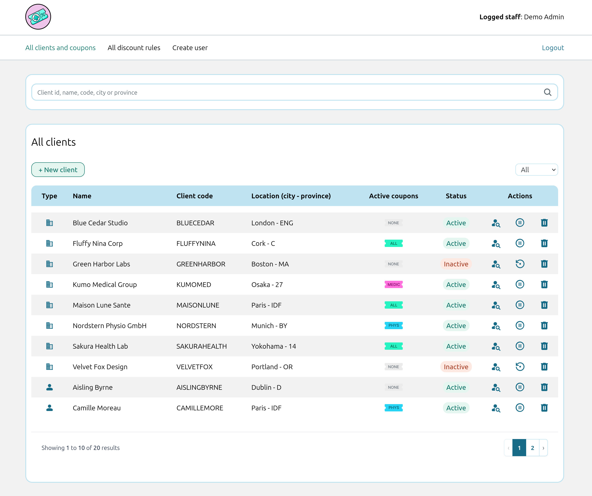
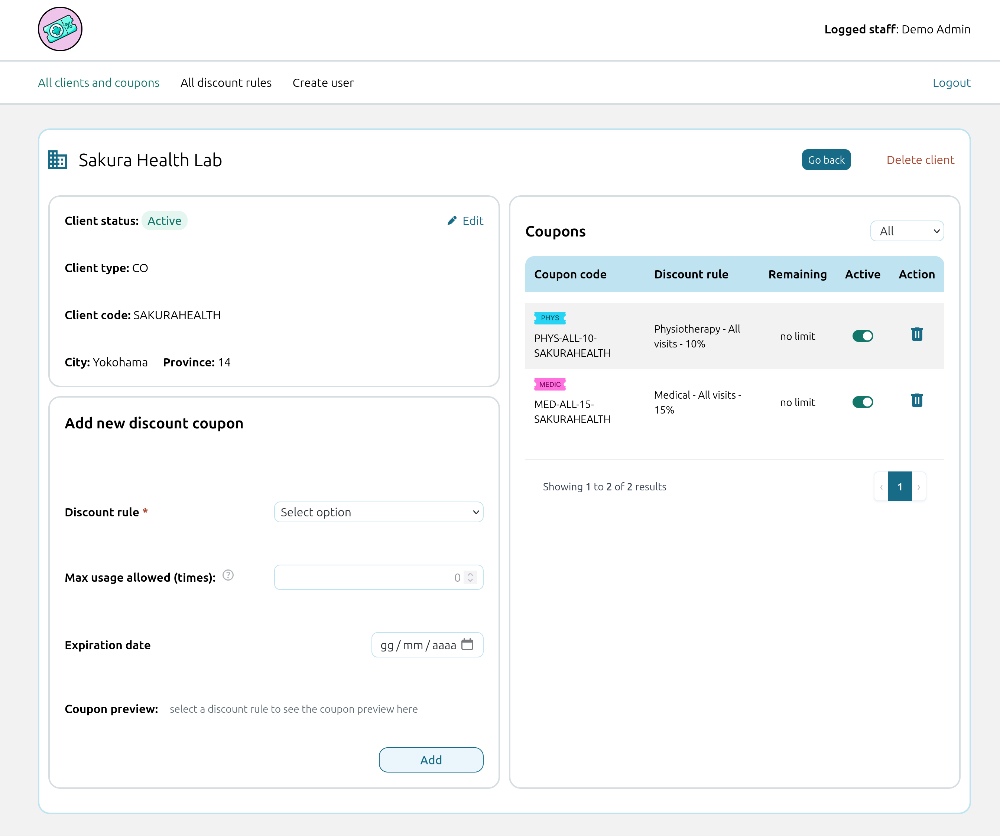
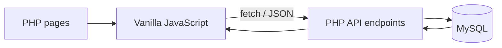
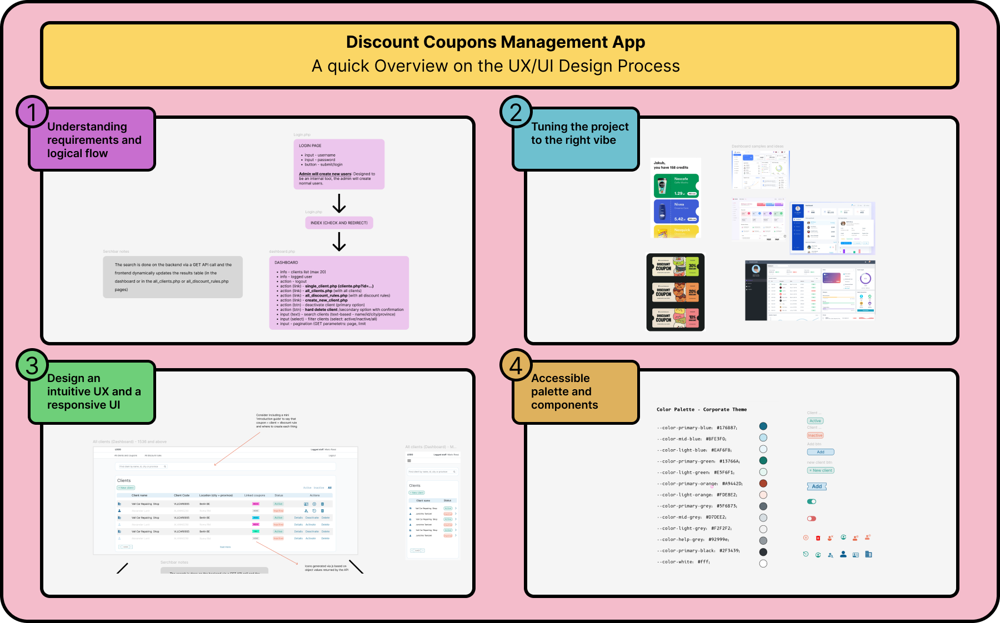
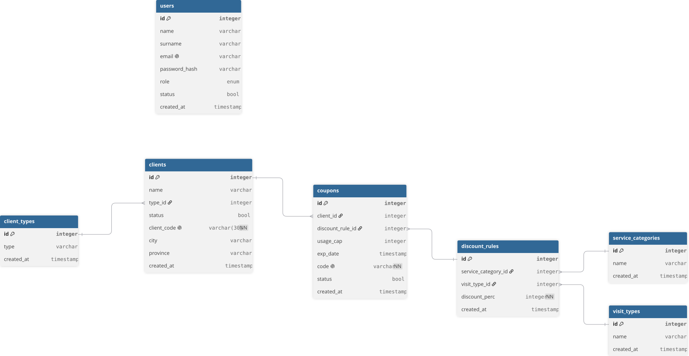

# Discount Coupons Management App

A small internal web application for managing clients, reusable discount rules and client-specific discount coupons.

What started as a request to turn a spreadsheet into "a simple page on the website" gradually became a much more interesting exercise in data modelling, API design, validation, authentication, UX and relational integrity.

The project deliberately keeps a relatively simple stack — PHP, MySQL, vanilla JavaScript and Tailwind CSS — while separating responsibilities between the frontend, JSON API endpoints and the database.



## From a spreadsheet to an actual system

The original request behind this project sounded straightforward: reproduce the logic of an existing spreadsheet inside a 'ridiculously simple' web page to add to our website and generate coupon codes by concatenating a few selected values.

That works until you start asking a few less straightforward questions.

*Who does a coupon belong to?*

*How do you know whether that client already has the same discount?*

*What happens after the first few dozen clients?*

*Where does the history live?*

*Which data should remain stable if a client's information changes?*

*Should JavaScript be trusted to decide what gets stored?*

*How do reusable discount conditions differ from the coupon eventually assigned to a client?*

*And, if coupons are eventually supposed to be redeemed somewhere else, which system should actually know that a coupon has been used?*

At that point, simply recreating the spreadsheet no longer made much sense.

Needless to say, once the “simple web page” turned out to require most of the foundations of an actual web application, the real-world answer to the request was no. The interesting part, however, was that I kept thinking about what a proper implementation would actually look like.

I therefore used the original request as the starting point for a more complete application model built around persistent client records, reusable discount rules, generated coupons, authentication, JSON API endpoints and a relational database.

The result is intentionally not a complete billing, booking or coupon-redemption platform. Its purpose is to model the part of the workflow that can be meaningfully implemented without inventing an integration with an external management system that does not exist.

## Application overview

The core domain can be reduced to one relationship:

```text
Client + Discount Rule -> Coupon
```

The application is built around the following entities:

| Entity                 | Purpose                                                                                                                |
| ---------------------- | ---------------------------------------------------------------------------------------------------------------------- |
| **Users**              | Staff accounts that can access the application. Users can have `admin` or `user` roles.                                |
| **Clients**            | The people or companies that can receive coupons. Clients are classified as private (`PR`) or company (`CO`) clients.  |
| **Client Types**       | Database-backed lookup values for the supported client categories.                                                     |
| **Service Categories** | The areas to which a discount can apply: Physiotherapy, Medical or All services.                                       |
| **Visit Types**        | Define whether a discount applies only to a first visit or to all visits.                                              |
| **Discount Rules**     | Reusable combinations of service category, visit type and discount percentage.                                         |
| **Coupons**            | Client-specific assignments of one discount rule, with their own expiration, status and — when applicable — usage cap. |

A discount rule therefore describes **what discount is available**.

A coupon describes **that discount assigned to a particular client**.

### Example workflow

A staff member can:

1. authenticate with an individual application account;
2. create or find a client;
3. open the client's detail page;
4. select one of the existing discount rules;
5. provide an expiration date and, when required, a usage cap;
6. preview the resulting coupon code;
7. submit the request;
8. let the backend independently validate the real client and rule data;
9. generate and persist the final coupon.

The coupon code uses a readable structure:

```text
[SERVICE_CATEGORY]-[VISIT_TYPE]-[DISCOUNT_PERCENTAGE]-[CLIENT_CODE]
```

For example:

```text
MED-ALL-15-NINAFLUFFY
```

The frontend can preview this value for immediate feedback, but it is not authoritative: the persisted code is regenerated server-side using database data.



## Business rules

Some of the most important rules are deliberately enforced beyond the UI.

A client has a unique, human-readable `client_code`. It is normalized to uppercase when the client is created and remains immutable afterwards, giving coupons a stable client identifier even if other profile information changes.

Discount rules are reusable definitions rather than client-specific records. A rule is uniquely defined by:

```text
service category + visit type + discount percentage
```

A client cannot receive the same discount rule twice. This is enforced by the database through the combination:

```sql
UNIQUE (client_id, discount_rule_id)
```

`usage_cap` is conditional rather than universally applicable.

For **First visit only** rules, it is required. The current application rules use a minimum of `1` for private clients (`PR`) and `5` for company clients (`CO`).

For **All visits** rules, `usage_cap` has no meaningful role and is stored as `NULL`.

Every coupon also has its own future expiration date and operational active/inactive status.

### A note on coupon usage

The application stores the configured `usage_cap`, but it does not pretend to know when a coupon has actually been redeemed.

In a real implementation, redemption would happen inside another operational system — for example billing, booking or practice-management software. That system, or an API connecting to it, would need to report each use before an authoritative remaining-usage count could be maintained.

Without such an integration, automatically decrementing the value inside this application would create the appearance of accuracy without having a reliable source for the underlying event.

This is one of the deliberate boundaries of the project rather than a simulated integration with an imaginary external API.

## Architecture

The application is server-rendered, but data operations are separated from the frontend pages.



Responsibilities are intentionally split:

```text
PHP pages        -> initial HTML and interface structure
JavaScript       -> fetch requests, dynamic rendering and UI behaviour
PHP API files    -> validation, business rules and database operations
MySQL            -> persistence and relational integrity
```

This allowed me to keep a conventional PHP stack while introducing a much clearer boundary between interface code and data operations instead of placing form handling, SQL and rendering logic inside the same page.

Login is intentionally an exception and uses a traditional server-side POST with PHP sessions.

## API and data-integrity approach

The application uses dedicated JSON endpoints for clients, discount rules, coupons, dynamic lookup data and user creation.

Depending on the resource, the endpoints support `GET`, `POST`, `PATCH` and `DELETE` operations, returning HTTP status codes together with predictable JSON responses.

Validation is layered:

```text
Frontend
    -> usability constraints and immediate feedback

PHP backend
    -> authoritative input and business-rule validation

MySQL
    -> relational and uniqueness guarantees
```

Important relationships are protected with foreign keys, while logical duplicates are protected through database `UNIQUE` constraints.

Examples include:

* unique user emails;
* unique client codes;
* unique discount-rule combinations;
* unique client/discount-rule coupon assignments;
* foreign keys between clients, client types, coupons, discount rules and lookup tables.

Prepared statements are used for queries involving request data.

The frontend is also not trusted as the source of relational or generated data. When creating a coupon, the backend re-reads the selected client and discount rule before validating the operation and generating the persisted coupon code.

## Authentication and authorization

The original concept of a shared login was eventually replaced with individual staff accounts.

Authentication uses PHP sessions and password hashing.

The current model includes:

* individual user accounts identified by email;
* hashed passwords;
* active/inactive account status;
* PHP session regeneration after authentication;
* `admin` and `user` roles;
* admin-only user creation;
* authorization checks on privileged backend operations.

This remains intentionally lightweight rather than attempting to reproduce a complete identity-management platform.

## UX/UI design

The repository includes the Figma material used during the main UX/UI design phase. The implementation continued to evolve during development, so some visual details and controls differ from the original layouts as new requirements and usability considerations emerged.

The design work covered application structure, navigation, forms, tables, filtering, responsive behaviour, visual hierarchy, colour choices and interaction states.

Several implementation decisions also came directly from UX questions rather than technical convenience.

For example, coupons are created from the **client detail page** rather than from a global form that asks the user to independently select both a client and a discount rule. The operational question is normally:

> Which coupon do I want to give this client?

Keeping the client context fixed removes one unnecessary choice and makes the workflow easier to follow.

Other examples include database-backed dropdowns, conditional form controls, coupon previews, server-side search and pagination, status filters and readable identifiers instead of exposing database IDs as primary interface labels.

The Figma source material is included in the repository to document the design process alongside the implementation.



[View the Figma source file](./docs/design/discount-coupons-project.fig)

## Accessibility

Accessibility was considered as part of the interface design rather than as a separate visual polish step.

The implementation pays attention to areas such as:

* semantic HTML structure;
* keyboard and focus behaviour;
* visible interaction states;
* colour and contrast choices;
* accessible form labelling;
* ARIA attributes where additional context is required;
* responsive navigation and interaction patterns.

The project does not claim formal WCAG or European Accessibility Act certification, but accessibility was treated as a genuine implementation constraint throughout the UI work.

## Development environment

The complete local development environment is orchestrated with Docker Compose.

The main services are:

```text
PHP / Apache
MySQL
Tailwind CSS watcher
phpMyAdmin
```

The application source is bind-mounted into the relevant development containers so local code changes are immediately reflected inside Docker.

MySQL data instead lives in a named volume because database persistence has a different lifecycle from application source code.

The Tailwind container also keeps its installed `node_modules` isolated from the application bind mount, preventing the mounted source directory from masking dependencies installed into the container image.

MySQL includes a health check, allowing the PHP service to wait until the database is actually ready rather than merely waiting for the database container to exist.

This setup also keeps PHP, MySQL, Node/Tailwind and their dependencies inside the project environment rather than requiring each toolchain to be installed independently on the host machine.

## Tailwind CSS

Tailwind CSS is integrated as part of the development toolchain rather than included from a CDN.

A dedicated Node container runs the Tailwind CLI in watch mode and rebuilds the generated CSS as source files change.

Dependency versions are defined through `package.json` and its lock file so the development environment remains reproducible across machines.

I chose Tailwind partly to work with an established utility-first workflow that is common in modern frontend teams while still retaining control over custom CSS where appropriate.

## Database design

The original spreadsheet-like model was replaced by separate relational entities with different responsibilities and lifecycles.

This distinction is particularly important between discount rules and coupons: duplicating all discount information inside every coupon would make reusable business rules harder to maintain and reason about.

The repository includes the database schema with demo data so the project can be evaluated locally without relying on real customer information.

It also includes a DBML representation of the schema together with an exported diagram that can be inspected directly from this README.



[View the DBML source](./database/graphical_app_db_schema_for_dbdiagram_io.dbml)

The DBML file can be imported into [dbdiagram.io](https://dbdiagram.io/) to inspect or modify the relational model visually.

## Running the project locally

### Requirements

Only Docker with Docker Compose support is required on the host.

PHP, Apache, MySQL, Node/Tailwind and phpMyAdmin run inside containers.

### Start the environment

Clone the repository:

```bash
git clone https://github.com/devis4wd/discount-coupons-management-app.git
cd discount-coupons-management-app
```

Build and start the services:

```bash
docker compose up --build -d
```

On the first start with a new MySQL volume, Docker automatically imports the repository's demo database dump:

```text
database/demo_database.sql
```

The dump contains the complete schema and non-sensitive dummy data required to explore the application, including a demo administrator account. No manual database import is required for a fresh environment.

The application is then available at:

```text
http://localhost:8080
```

phpMyAdmin is available at:

```text
http://localhost:8081
```

### Demo application account

```text
Email:    admin@companydomain.com
Password: DemoAdmin!2026
```

These credentials are intentionally public and exist only inside the local demo database distributed with this repository.

### Local configuration

The repository intentionally includes its `.env` file because it contains only non-sensitive local development values used by the demo environment:

```text
MYSQL_DATABASE=app_db
MYSQL_USER=app_user
MYSQL_PASSWORD=secret
MYSQL_ROOT_PASSWORD=rootsecret
```

The project does not contain production credentials, customer data or personal secrets. For the same reason, a separate `.env.example` would add an extra setup step without providing a meaningful security benefit for this repository.

`compose.yaml` also defines matching fallback values for the local Docker environment, while the included configuration files are limited to demo/local settings. In a real deployment, environment-specific credentials and secrets should of course be kept outside version control.

### Stop or reset the environment

To stop the application without deleting the persistent database volume:

```bash
docker compose down
```

The SQL dump is used when MySQL initializes a new, empty database volume. If the database volume already exists, normal `docker compose up` commands preserve its current data.

To delete the local database and rebuild the original demo state from `database/demo_database.sql`:

```bash
docker compose down -v
docker compose up --build -d
```

## Project documentation

The README is intentionally an overview rather than an exhaustive implementation reference.

More detailed documentation is available in the repository.

### [`technical_spec.md`](./docs/technical_spec.md)

A concise reference for the current implementation, including:

* application architecture;
* project structure;
* authentication and authorization;
* data model;
* business rules;
* API responsibilities;
* validation and integrity rules;
* main application workflows.

### [`design_decisions.md`](./docs/design_decisions.md)

Documents the reasoning behind important choices, including alternatives that were considered and deliberately rejected.

Examples include:

* moving away from the original flat spreadsheet model;
* separating discount rules from coupons;
* making the client the starting point of coupon creation;
* keeping database IDs internal;
* introducing an immutable client code;
* redesigning the coupon-code format;
* enforcing relational uniqueness in MySQL;
* keeping existing discount rules effectively immutable;
* moving authoritative validation away from the frontend;
* separating frontend pages from JSON endpoints;
* replacing the original shared-login concept with individual users.

### Database schema

[`graphical_app_db_schema_for_dbdiagram_io.dbml`](./database/graphical_app_db_schema_for_dbdiagram_io.dbml) contains the schema in DBML format for visual exploration with dbdiagram.io.

### Figma

The repository also contains the [Figma design source](./docs/design/discount-coupons.fig) used to explore and define the main UX/UI structure, visual direction and workflows, with the interface continuing to evolve during implementation, together with exported screens for easier inspection without requiring Figma.


## Deliberate scope

This project is deliberately smaller than a complete production management platform.

It does not implement:

* booking or billing workflows;
* real coupon redemption;
* synchronization with third-party management software;
* fabricated integrations with external APIs for which no real contract was available.

It also deliberately remains a PHP/JavaScript application rather than introducing React, Vue, an ORM or additional infrastructure simply to make the architecture appear more complex.

Those boundaries allowed the project to stay focused on the problems it was actually designed to explore: relational modelling, API responsibilities, data integrity, validation, authentication, application state and usable CRUD workflows.

## AI-assisted workflow

AI tools were used as part of the development process as a support and learning aid.

That included discussing implementation alternatives, debugging problems, reviewing refactoring approaches, explaining unfamiliar concepts, and helping polish documentation, formatting and code comments.

I did not treat generated output as an authoritative technical source or as a substitute for understanding the resulting implementation. Decisions changed repeatedly during development as assumptions were tested against the actual application model, and the reasoning behind the most important ones is documented in [`design_decisions.md`](./docs/design_decisions.md).

The goal of including this note is simply to be transparent about the development workflow rather than pretending that modern tooling was not part of it.

## What this project represents

The final application is not especially large, and that is not really the point.

The most useful part of the project was the transition from:

```text
"Take these spreadsheet values and concatenate them into a coupon."
```

to questions such as:

```text
What is the actual data model?

Which records should be reusable?

What identifies a client over time?

Where should uniqueness be enforced?

Which system is authoritative for a business rule?

What data should JavaScript be allowed to decide?

What happens when the dataset grows?

How should a real user move through the workflow?

And where should the responsibility of this application end?
```

Answering those questions changed the application much more than adding another page or another framework would have.

That evolution — from implementing the visible request to modelling the system behind it — is the part of the project I consider most representative of the way I approach development.

